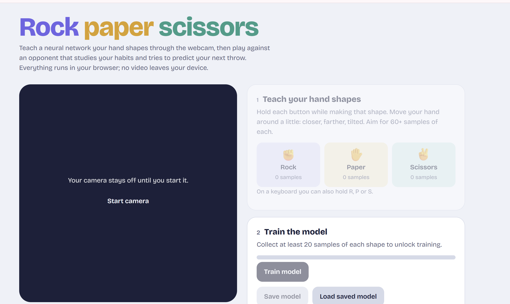

# ✊✋✌️ Webcam Rock Paper Scissors AI

Play rock paper scissors against an AI using your webcam. You train a neural network to recognize your hand shapes right in the browser, then face an opponent that learns your habits and tries to predict your next throw.

**[▶ Play it live](https://YOUR-USERNAME.github.io/rps-webcam-ai/)**



## Features

- **Train your own model in seconds.** Record examples of each hand shape with your webcam, and a convolutional neural network (CNN) trains right in your browser.
- **Live predictions.** See the model's confidence for rock, paper, and scissors update in real time.
- **An opponent that learns you.** The AI studies your past throws with a Markov model and plays the move that beats what it expects.
- **Explainable rounds.** After each round, see the exact frame the model judged and why the AI threw what it did.
- **Save and load.** Keep your trained model in the browser so you don't have to retrain.
- **Private.** Everything runs locally. No video or images ever leave your device.

## How to play

1. Click **Start camera** and allow camera access.
2. **Teach your hand shapes.** Hold the Rock, Paper, or Scissors button (or the R, P, S keys) while making that shape. Record 60+ samples of each, moving your hand around.
3. Click **Train model** and wait 10–30 seconds.
4. Click **Save model** so you can skip training next time.
5. Click **Play a round**. Throw your shape on **"Shoot!"** and hold it still for a moment.

## How it works

### Hand recognition (supervised learning)

Each webcam frame is cropped to the center square and shrunk to a 64×64 color image. The model is a small CNN built with TensorFlow.js:

```
Input 64×64×3
→ Conv 16 → MaxPool
→ Conv 32 → MaxPool
→ Conv 64 → MaxPool
→ Flatten → Dropout 0.4 → Dense 64 → Dense 3 (softmax)
```

- **Data augmentation:** each training image also gets a mirrored copy with a random brightness shift, so the model handles both hands and different lighting.
- **Honest testing:** the last 15% of samples for each shape are held out and never trained on, so the accuracy score reflects photos the model hasn't seen.
- **Steady-hand detection:** after "Shoot!", the game ignores the first 0.3 seconds of motion, then locks in the first move the model reads with at least 70% confidence on three frames in a row.

### The AI opponent (pattern learning)

The AI uses a Markov model that keeps count of what you throw after each sequence of your last 1, 2, or 3 moves. Before each round, it:

1. Looks up your recent moves, starting with the longest pattern it has enough data for.
2. Predicts your most likely next throw.
3. Plays the move that beats it.

It commits to its move **before** the countdown ends, so it never sees your hand. About 10% of the time it throws randomly to keep things unpredictable. The more you play, the better it gets at spotting your habits.

## Run it locally

You need a local server because browsers block the webcam on pages opened straight from a file.

**VS Code:** install the **Live Server** extension, open the project folder, right-click `index.html`, and choose **Open with Live Server**.

**Python:** in the project folder, run

```bash
python -m http.server 8000
```

and open http://localhost:8000.

## Project structure

| File | Purpose |
|---|---|
| `index.html` | Page layout |
| `style.css` | Styling, with light and dark mode |
| `app.js` | Webcam capture, model training, live prediction, AI opponent, and game logic |

## Tips for better accuracy

- Hold your hand out in front of your chest, away from your face, so it fills most of the dashed square.
- Use a plain background and even lighting.
- Move your hand around while recording: closer, farther, tilted.
- If the model mixes up two shapes, record more samples of those two and retrain.

## Built with

- [TensorFlow.js](https://www.tensorflow.org/js) for the neural network
- Plain HTML, CSS, and JavaScript, with no build step and no dependencies to install

## Ideas for improvement

- Use a hand-landmark model (like MediaPipe Hands) so recognition doesn't depend on background or lighting
- Add a "no hand" class so the game knows when nothing is showing
- Track win rates over time and chart how well the AI is learning your patterns

## License

[MIT](LICENSE)
